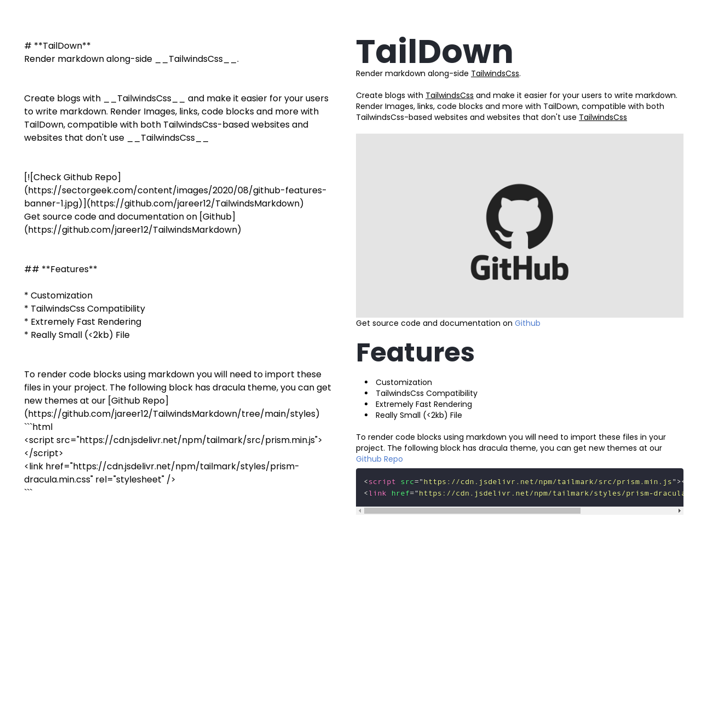

# Markdown For Tailwinds

⚡ Markdown parser compatible with Tailwind Css


## Installation

```html
<!-- Main File -->
<script src="https://cdn.jsdelivr.net/npm/tailmark/src/index.min.js"></script>
```

```html
<!-- For Code Snippets -->
<script src="https://cdn.jsdelivr.net/npm/tailmark/src/prism.min.js"></script>
<link
  href="https://cdn.jsdelivr.net/npm/tailmark/styles/dracula.min.css"
  rel="stylesheet"
/>
```

## Usage

```js
const Parser = new Tayparser();
```

```js
// Parse Markdown
const MarkdownCode = `
# Blog Post
`;
const Code = Parser.parse(MarkdownCode);
console.log(Code);
```

```js
// Highlight All <pre> Snippets
Prism.highlightAll();
```

```js
// Escape HTML
const Markdown = new TailDown({ escapeHTML: true });
```

## Config

```js
const Markdown = new TailDown({
  a: {
    customClass: "hover:text-blue-500",
    extendStyle: "display: block;",
  },
  h3: {
    customClass: "text-gray-600",
    extendStyle: "display: block;",
  },
});
```

Code snippet(`<pre>`) themes are in [The theme folder](./styles).
